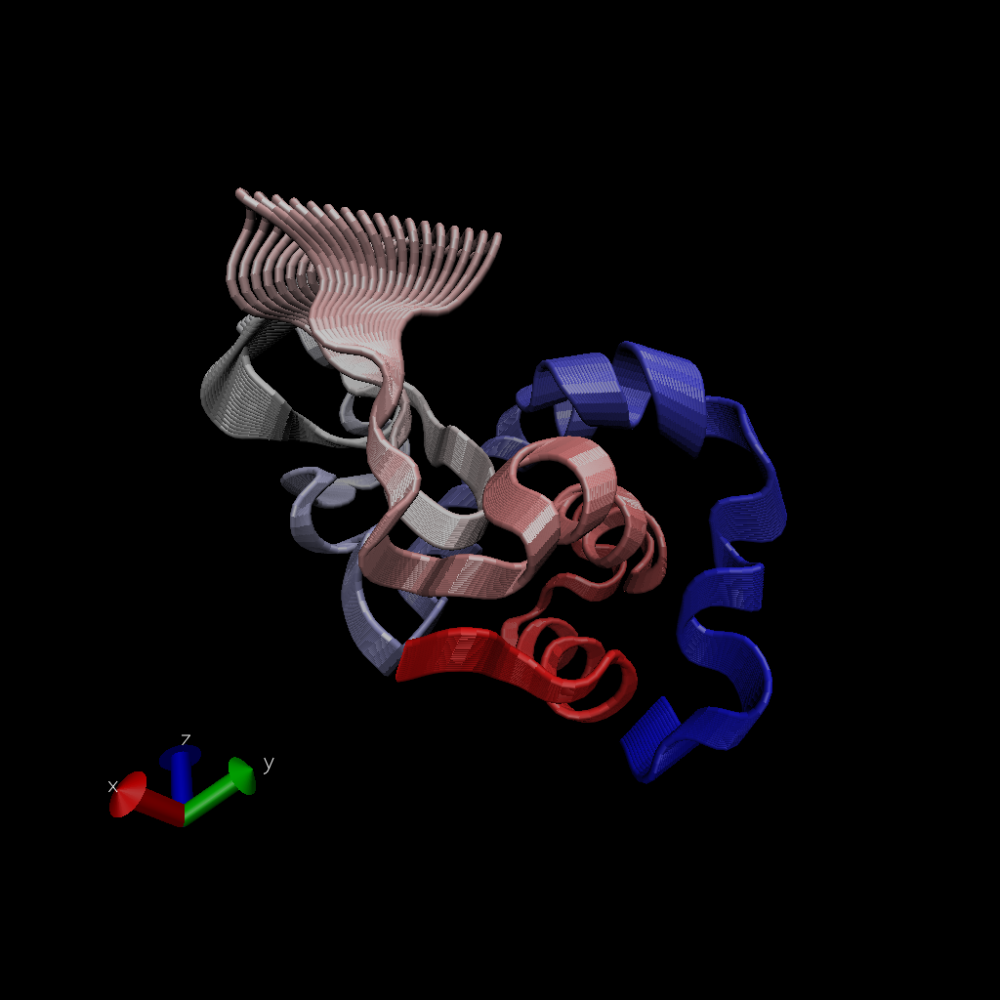

\#Comparative analysis of protein structures

using the bio3d package


```r
library(bio3d)

pdb <- read.pdb("1hel")
```

```
##   Note: Accessing on-line PDB file
```

```r
pdb
```

```
## 
##  Call:  read.pdb(file = "1hel")
## 
##    Total Models#: 1
##      Total Atoms#: 1186,  XYZs#: 3558  Chains#: 1  (values: A)
## 
##      Protein Atoms#: 1001  (residues/Calpha atoms#: 129)
##      Nucleic acid Atoms#: 0  (residues/phosphate atoms#: 0)
## 
##      Non-protein/nucleic Atoms#: 185  (residues: 185)
##      Non-protein/nucleic resid values: [ HOH (185) ]
## 
##    Protein sequence:
##       KVFGRCELAAAMKRHGLDNYRGYSLGNWVCAAKFESNFNTQATNRNTDGSTDYGILQINS
##       RWWCNDGRTPGSRNLCNIPCSALLSSDITASVNCAKKIVSDGNGMNAWVAWRNRCKGTDV
##       QAWIRGCRL
## 
## + attr: atom, xyz, seqres, helix, sheet,
##         calpha, remark, call
```

let's use a bioinformarics method called NMA (Normal Mode ANalysis) to predict the dynamics (flexibilty) of this enzyme.


```r
modes <- nma(pdb)
```

```
##  Building Hessian...		Done in 0.021 seconds.
##  Diagonalizing Hessian...	Done in 0.118 seconds.
```

```r
plot(modes)
```

<!-- --> 

make a "move" of its predicted motion. we often call this a "trajectory"


```r
mktrj(modes, file="nma.pdb")
```




```r
hits <- NULL
hits$pdb.id <- c('1AKE_A','4X8M_A','6S36_A','6RZE_A','4X8H_A','3HPR_A','1E4V_A','5EJE_A','1E4Y_A','3X2S_A','6HAP_A','6HAM_A','4K46_A','4NP6_A','3GMT_A','4PZL_A')
```

# download PDB files


```r
#files <- get.pdb(hits$pdb.id, path="pdbs", split=TRUE, gzip=TRUE)
```

Multiple structure alignment


```r
#pdb <- pdbaln(files, fit= TRUE)
```


```r
pdb
```

```
## 
##  Call:  read.pdb(file = "1hel")
## 
##    Total Models#: 1
##      Total Atoms#: 1186,  XYZs#: 3558  Chains#: 1  (values: A)
## 
##      Protein Atoms#: 1001  (residues/Calpha atoms#: 129)
##      Nucleic acid Atoms#: 0  (residues/phosphate atoms#: 0)
## 
##      Non-protein/nucleic Atoms#: 185  (residues: 185)
##      Non-protein/nucleic resid values: [ HOH (185) ]
## 
##    Protein sequence:
##       KVFGRCELAAAMKRHGLDNYRGYSLGNWVCAAKFESNFNTQATNRNTDGSTDYGILQINS
##       RWWCNDGRTPGSRNLCNIPCSALLSSDITASVNCAKKIVSDGNGMNAWVAWRNRCKGTDV
##       QAWIRGCRL
## 
## + attr: atom, xyz, seqres, helix, sheet,
##         calpha, remark, call
```


```r
#ids <- basename.pdb(pdb$id)
```


```r
#plot(pdb, labels=ids)
```

we will use the bio3d pca() function which is designed for protein structure data.


```r
#pc.xray <- pca(pdb)
#plot(pc.xray)
```

make a trajectory vsiualization of the motion captured by the first Principal component

# Visualize first principal component


```r
#pc1 <- mktrj(pc.xray, pc=1, file="pc_1.pdb")
```


