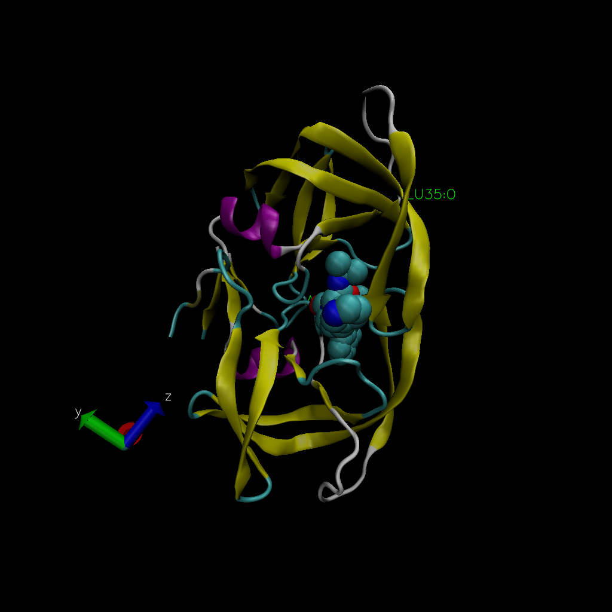

```{r}
db <- read.csv("Data Export Summary.csv", row.names = 1)
head(db)
```

> Q1: What percentage of structures in the PDB are solved by X-Ray and Electron Microscopy.

```{r}
method.sums <- colSums(db)
round((method.sums/method.sums["Total"]) * 100,2)
```

> Q2: What proportion of structures in the PDB are protein?

```{r}
round((db$Total/method.sums["Total"]) * 100, 2)
```

The proportion is 87.36

> Q3: Type HIV in the PDB website search box on the home page and determine how many HIV-1 protease structures are in the current PDB?

There are 1828 protease structures

> Q4: Water molecules normally have 3 atoms. Why do we see just one atom per water molecule in this structure?

The red spheres are being diplayed as the water molecule. \>Q5: There is a conserved water molecule in the binding site. Can you identify this water molecule? What residue number does this water molecule have (see note below)?

Residue number is 35

```{r}
library(bio3d)
```

```{r}
pdb <- read.pdb("1hsg")
```

```{r}
read.pdb(file = "1hsg")

```

```{r}
print(pdb)
```



> Q7: How many amino acid residues are there in this pdb object?

198

> Q8: Name one of the two non-protein residues?

HOH 
>Q9: How many protein chains are in this structure?

2

```{r}
attributes(pdb)
```

```{r}
head(pdb$atom)
```
