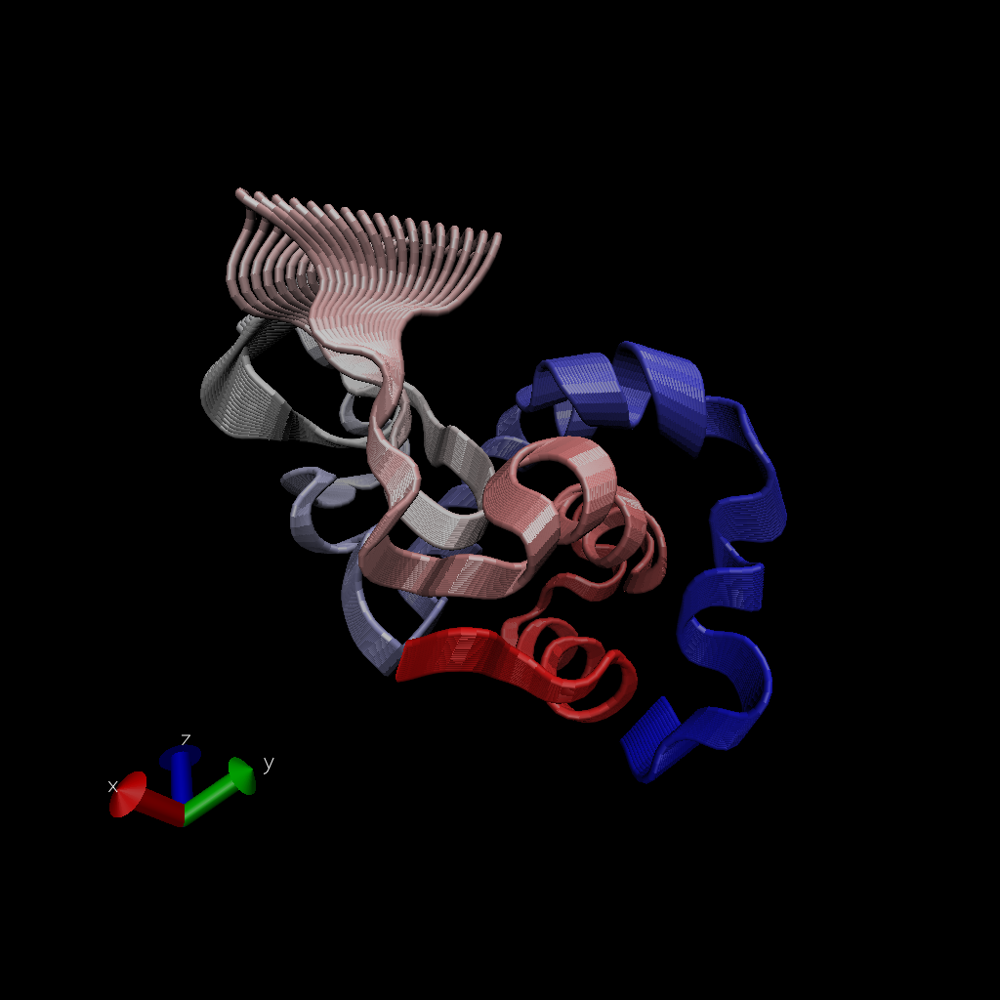
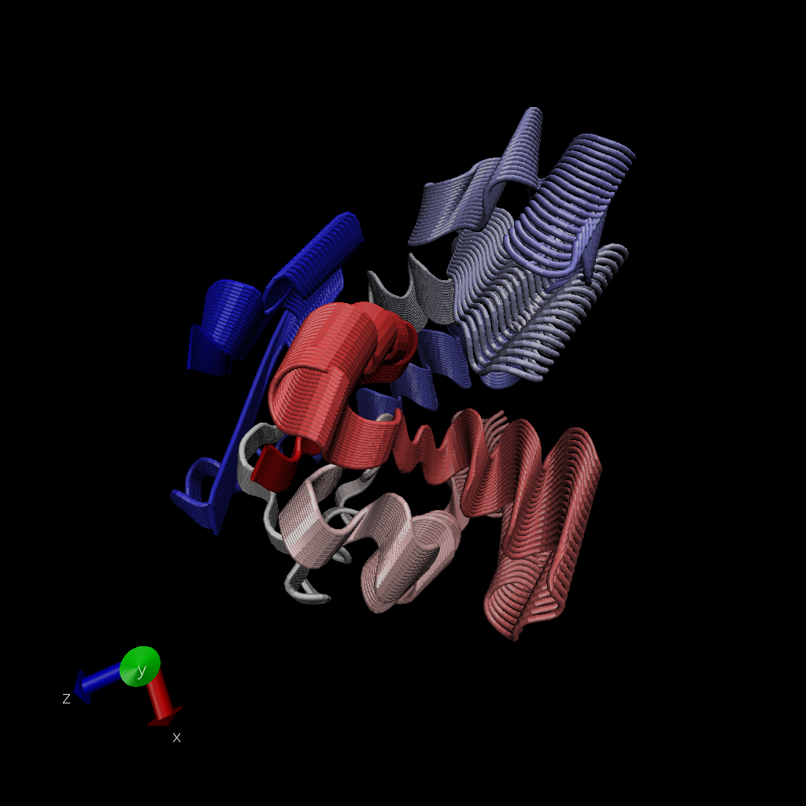

> Q7: How many amino acid residues are there in this pdb object?

198

> Q8: Name one of the two non-protein residues?

HOH 
>Q9: How many protein chains are in this structure?

2


#Comparative analysis of protein structures

using the bio3d package

```{r}
library(bio3d)

pdb <- read.pdb("1hel")
pdb
```

let's use a bioinformarics method called NMA (Normal Mode ANalysis) to predict the dynamics (flexibilty) of this enzyme.

```{r}
modes <- nma(pdb)
plot(modes)
```

make a "move" of its predicted motion. we often call this a "trajectory"

```{r}
mktrj(modes, file="nma.pdb")
```



```{r}
hits <- NULL
hits$pdb.id <- c('1AKE_A','4X8M_A','6S36_A','6RZE_A','4X8H_A','3HPR_A','1E4V_A','5EJE_A','1E4Y_A','3X2S_A','6HAP_A','6HAM_A','4K46_A','4NP6_A','3GMT_A','4PZL_A')
```

# download PDB files

```{r}
files <- get.pdb(hits$pdb.id, path="pdbs", split=TRUE, gzip=TRUE)
```

Multiple structure alignment

```{r}
pdb <- pdbaln(files, fit= TRUE)
```

```{r}
pdb
```

```{r}
ids <- basename.pdb(pdb$id)
```

```{r}
plot(pdb, labels=ids)
```

we will use the bio3d pca() function which is designed for protein structure data.

```{r}
pc.xray <- pca(pdb)
plot(pc.xray)
```

make a trajectory vsiualization of the motion captured by the first Principal component

# Visualize first principal component

```{r}
pc1 <- mktrj(pc.xray, pc=1, file="pc1.pdb")
```



> Q10. Which of the packages above is found only on BioConductor and not CRAN?

MSA

> Q11. Which of the above packages is not found on BioConductor or CRAN?:

devtools::install_bitbucket("Grantlab/bio3d-view")

> Q12. True or False? Functions from the devtools package can be used to install packages from GitHub and BitBucket?

TRUE

> Q13. How many amino acids are in this sequence, i.e. how long is this sequence?

214
